# COMP3710 Lab Demonstration 2 (2026)

PyTorch solutions and experiment evidence for COMP3710 Lab Demonstration 2. The repository covers the supplied exercises (DFT, Eigenfaces, an LFW CNN, and a from-scratch CIFAR-10 ResNet-18) plus all three Part 4 recognition tasks on the preprocessed OASIS brain MRI dataset:

- Task 1: convolutional Variational Autoencoder (VAE)
- Task 2: four-class U-Net segmentation
- Task 3: 64 x 64 DCGAN brain-image generation

The commands below assume they are run from the repository root. The OASIS defaults already point to the Rangpur location `/home/groups/comp3710/OASIS`; use `--data-root` or `--image-dir` when the dataset is elsewhere.

## Lab requirements covered

| Lab section | Implementation | Demonstration evidence |
|---|---|---|
| Part 1 - DFT | NumPy DFT/FFT and explicit PyTorch CPU/GPU DFT | reconstruction plots, timing comparison, and correctness check |
| Part 2 - Eigenfaces | NumPy SVD/PCA plus Random Forest | eigenfaces, compactness curve, accuracy, and classification report |
| Part 3.1 - CNN | two required 3 x 3, 32-filter convolutions plus dense classifier | full-test accuracy, curves, and sample predictions |
| Part 3.2 - DAWNBench | from-scratch ResNet-18, BF16, OneCycleLR, MixUp, and TTA | training time, CIFAR-10 accuracy, saved best model, live inference, and one live epoch |
| Part 4 Task 1 - VAE | 256 x 256 convolutional beta-VAE | reconstruction, random generation, loss curves, and UMAP manifold |
| Part 4 Task 2 - U-Net | 256 x 256 four-channel categorical U-Net | per-class DSC, complete test evaluation, and live single-image inference |
| Part 4 Task 3 - GAN | grayscale 64 x 64 DCGAN | fixed-noise samples, losses, discriminator diagnostics, and diversity checks |

All neural networks are implemented in this repository. `torchvision` is used for data loading/utilities, not for a pre-built model.

## Repository layout

```text
.
├── other_part/
│   ├── part1_teacher_code.ipynb
│   ├── part2_eigenfaces_teacher_code.ipynb
│   ├── part3_1_cnn_classifier.ipynb
│   ├── part3_2_resnet18.py
│   └── part3_2_demo.py
├── task1_vae/
│   ├── dataset.py
│   ├── vae.py
│   ├── train_vae.py
│   ├── visualize_vae.py
│   └── results/
├── task2_unet/
│   ├── dataset.py
│   ├── model.py
│   ├── train.py
│   ├── evaluate.py
│   ├── inference.py
│   └── results/
├── task3_gan/
│   ├── dataset.py
│   ├── model.py
│   ├── train.py
│   └── results/                 # created by training
└── requirements.txt
```

## Environment setup

Python 3.10+ and a CUDA-capable GPU are recommended. The OASIS models can fall back to CPU, but full training is intended for Rangpur. The optimized ResNet-18 pipeline keeps CIFAR-10 on the GPU and its demonstration script deliberately requires CUDA.

```bash
python3 -m venv .venv
source .venv/bin/activate
python -m pip install --upgrade pip
python -m pip install -r requirements.txt
```

On Rangpur, prefer the course-provided CUDA/PyTorch environment when available, then install only missing packages. Confirm that PyTorch can see the allocated GPU before training:

```bash
python -c "import torch; print('CUDA:', torch.cuda.is_available()); print('GPU:', torch.cuda.get_device_name(0) if torch.cuda.is_available() else 'CPU')"
```

Set one convenience variable for the commands in this README:

```bash
export OASIS_ROOT=/home/groups/comp3710/OASIS
```

The expected OASIS layout is:

```text
$OASIS_ROOT/
├── keras_png_slices_train/
├── keras_png_slices_validate/
├── keras_png_slices_test/
├── keras_png_slices_seg_train/
├── keras_png_slices_seg_validate/
└── keras_png_slices_seg_test/
```

MRI files must be grayscale 256 x 256 PNGs. Segmentation masks must use raw values `0`, `85`, `170`, and `255`, which are mapped to class IDs `0`-`3`.

## Parts 1-3

Start Jupyter from the repository root so notebook caches and generated figures stay inside the project:

```bash
jupyter lab
```

Then run the notebooks in order:

1. `other_part/part1_teacher_code.ipynb` - compare NumPy FFT, explicit PyTorch CPU DFT, and explicit GPU DFT at several input sizes.
2. `other_part/part2_eigenfaces_teacher_code.ipynb` - run the completed reproducible section for PCA/SVD and Random Forest evaluation.
3. `other_part/part3_1_cnn_classifier.ipynb` - train the required two-convolution LFW classifier for 15 epochs.

LFW is downloaded on the first run and subsequently reused from its scikit-learn/project cache.

### Part 3.2 - full ResNet-18 training

Run this on a Rangpur GPU allocation. The script downloads CIFAR-10 into `./data` on its first run, trains the single 40-epoch target configuration, evaluates regularly, and records timing/accuracy metrics.

```bash
python other_part/part3_2_resnet18.py
```

Important outputs:

- `ResNet18_40epoch_target_best.pth` - best test-accuracy state dictionary
- `resnet18_experiment_results.csv` - final experiment summary
- `resnet18_epoch_metrics.jsonl` - per-epoch metrics
- `resnet18_experiment.log` - persistent console log

The implementation uses a from-scratch ResNet-18, GPU crop/flip, MixUp, label smoothing, Nesterov SGD, OneCycleLR, channels-last tensors, BF16 mixed precision, and horizontal-flip test-time augmentation. Pure training time excludes evaluation, matching the lab's speed comparison.

## Part 4 Task 1 - VAE

The VAE consumes normalized `[B, 1, 256, 256]` MRI slices and learns a 32-dimensional latent representation. The recommended recorded run uses `beta=5e-4` for 30 epochs.

### Train

```bash
python task1_vae/train_vae.py \
  --data-root "$OASIS_ROOT" \
  --epochs 30 \
  --batch-size 32 \
  --learning-rate 3e-4 \
  --latent-dim 32 \
  --beta 5e-4 \
  --run-name beta_5e4_30
```

Training saves `vae_last.pt`, the best-validation `vae_best.pt`, and `vae_history.json` under `task1_vae/results/beta_5e4_30/`. The built-in smoke test checks one optimization step, tensor shapes, finite losses/latents, and gradient norms before real training begins.

### Create evaluation figures

```bash
python task1_vae/visualize_vae.py \
  --data-root "$OASIS_ROOT" \
  --run-name beta_5e4_30 \
  --num-images 5
```

This uses the best checkpoint and the official test split to create:

- `reconstructions.png`
- `loss_curves.png`
- `latent_manifold_umap.png`
- `random_generations.png`

## Part 4 Task 2 - U-Net

The model returns raw categorical logits with shape `[B, 4, 256, 256]`. Targets are integer class IDs for cross-entropy, and the Dice term explicitly converts them to one-hot tensors. Final segmentations use `argmax`, so every pixel receives exactly one of four labels.

### Train

```bash
python task2_unet/train.py \
  --data-root "$OASIS_ROOT" \
  --epochs 50 \
  --batch-size 8 \
  --lr 1e-3
```

The best checkpoint is chosen by the minimum validation DSC across the four classes, directly matching the requirement that every label exceed `0.90`. Training writes:

- `task2_unet/checkpoints/best_unet.pt`
- `task2_unet/checkpoints/last_unet.pt`
- `task2_unet/results/training_history.csv`
- `task2_unet/results/loss_curve.png`
- `task2_unet/results/dice_curve.png`

### Evaluate the complete test set

```bash
python task2_unet/evaluate.py \
  --data-root "$OASIS_ROOT" \
  --checkpoint task2_unet/checkpoints/best_unet.pt \
  --batch-size 8 \
  --num-examples 5
```

This computes global per-class DSC over all test pixels, prints a PASS/FAIL check for every class, saves `test_metrics.csv`, and creates `test_segmentation_examples.png`.

### Run the required live inference

```bash
python task2_unet/inference.py \
  --data-root "$OASIS_ROOT" \
  --checkpoint task2_unet/checkpoints/best_unet.pt \
  --index 0
```

The command prints the selected MRI/mask names, input/output shapes, predicted classes, and per-image DSC. It also writes `task2_unet/results/demo_prediction.png` with the MRI, ground truth, prediction, and error map.

## Part 4 Task 3 - DCGAN

The GAN trains only on original MRI slices, never segmentation masks. Input PNGs are resized to 64 x 64 and normalized to `[-1, 1]` to match the generator's `tanh` output.

### Check the dataset

```bash
python task3_gan/dataset.py \
  --image-dir "$OASIS_ROOT/keras_png_slices_train"
```

### Train

```bash
python task3_gan/train.py \
  --image-dir "$OASIS_ROOT/keras_png_slices_train" \
  --epochs 50 \
  --batch-size 64 \
  --learning-rate 2e-4 \
  --run-name dcgan_64_d_train_mode
```

Each run is isolated under `task3_gan/results/<run-name>/` and contains the configuration, real-image reference grid, epoch-zero sample, fixed-noise samples after every epoch, CSV history, loss plots, diversity diagnostics, and latest/periodic checkpoints. A high `near_duplicate_rate` or very low `sample_pixel_std` is a warning to inspect the grids for mode collapse; visual review remains essential.

For a short end-to-end check:

```bash
python task3_gan/train.py \
  --image-dir "$OASIS_ROOT/keras_png_slices_train" \
  --epochs 1 \
  --max-batches 2 \
  --num-workers 0 \
  --run-name demo_smoke
```

## Live demonstration commands

Prepare the data and checkpoints before the practical. From the repository root, the following sequence directly addresses the live requirements.

### 1. Confirm the allocated GPU

```bash
python -c "import torch; print('CUDA ready:', torch.cuda.is_available()); print('GPU:', torch.cuda.get_device_name(0) if torch.cuda.is_available() else 'not allocated')"
```

### 2. ResNet-18: trained-model inference plus one complete live epoch

The full training command saves `ResNet18_40epoch_target_best.pth`. The demonstration helper first evaluates that trained model, then initializes a separate model, trains it for one complete epoch, and runs inference again.

```bash
python other_part/part3_2_demo.py \
  --checkpoint ResNet18_40epoch_target_best.pth \
  --batch-size 512
```

### 3. U-Net: required MRI segmentation inference

```bash
python task2_unet/inference.py \
  --data-root "$OASIS_ROOT" \
  --checkpoint task2_unet/checkpoints/best_unet.pt \
  --index 0
```

Optionally show the complete 544-image test result immediately afterwards:

```bash
python task2_unet/evaluate.py \
  --data-root "$OASIS_ROOT" \
  --checkpoint task2_unet/checkpoints/best_unet.pt
```

### 4. VAE: reproduce all required evidence from the saved model

```bash
python task1_vae/visualize_vae.py \
  --data-root "$OASIS_ROOT" \
  --run-name beta_5e4_30
```

Show the reconstruction grid, UMAP latent manifold, random generations, and loss curves from `task1_vae/results/beta_5e4_30/`.

### 5. GAN: prove the pipeline and show training evidence

```bash
python task3_gan/train.py \
  --image-dir "$OASIS_ROOT/keras_png_slices_train" \
  --epochs 1 \
  --max-batches 2 \
  --num-workers 0 \
  --run-name demo_smoke
```

Then show the full run's `samples/epoch_*.png`, `loss_curve.png`, `discriminator_components.png`, and `history.csv`. Explain how fixed noise exposes training progress and how the diversity columns help identify mode collapse.

The selected full run is `dcgan_64_d_train_mode`. The older `dcgan_64_baseline` run is retained locally only as a failed mode-collapse comparison and should not be presented as the final model.

### 6. Show repository ownership and development history

Part 4 must be hosted in your own GitHub account with meaningful commit history. Before the practical, push the final commit and be ready to show the repository while signed in:

```bash
git status --short
git log --oneline -10
```

The working tree should be clean after the final commit. Be prepared to explain the purpose of every model block, the loss functions, the train/validation/test separation, the reported metrics, and the limitations visible in the generated images.

## Checkpoints and reproducibility

- Random seeds are fixed to `42` throughout the scripted experiments.
- CUDA is selected automatically by the OASIS scripts; CPU is the fallback.
- PyTorch checkpoints (`*.pt` and `*.pth`) are ignored because they are large generated binaries. Train first or copy your saved cluster checkpoints into the documented paths before the demonstration.
- Do not move a results directory away from its checkpoint/history pair: the VAE visualization command expects both in the same run directory.
- Run commands from the repository root; several result and cache paths are intentionally relative to it.
- Record the GPU model, package versions, command, commit hash, accuracy/DSC, and wall time for any final result quoted to the demonstrator.

## Recorded results

These numbers are read from the result files currently included in this repository. Hardware metadata was not stored with the older runs, so their times should not be used for cross-hardware comparisons.

### VAE ablation

| Run | Epochs | Best epoch | Best validation total | Validation reconstruction | Validation KL | Recorded total epoch time |
|---|---:|---:|---:|---:|---:|---:|
| `beta_5e4` | 10 | 10 | 0.004471 | 0.003610 | 1.721205 | 190.6 s |
| `beta_5e4_30` | 30 | 17 | 0.004356 | 0.003666 | 1.380085 | 515.0 s |
| `beta_v1` | 30 | 30 | 0.009310 | 0.009308 | 0.000003 | 552.9 s |

The `beta=1` run has an almost-zero KL term, consistent with posterior collapse. Total objectives with different beta values are not directly comparable; use the reconstruction, KL behaviour, UMAP structure, and generated samples together when selecting a run for the demonstration. The 30-epoch `beta=5e-4` run is used for the figures below.

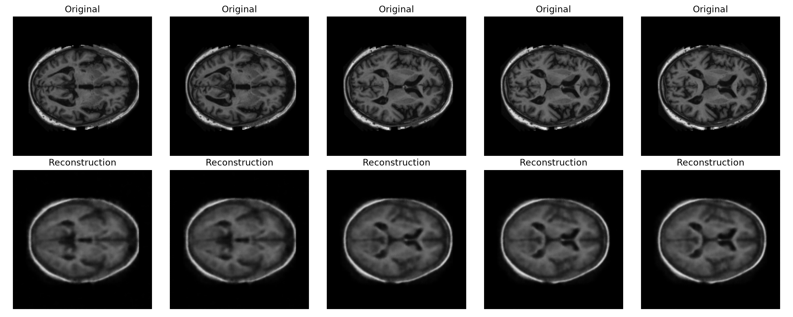

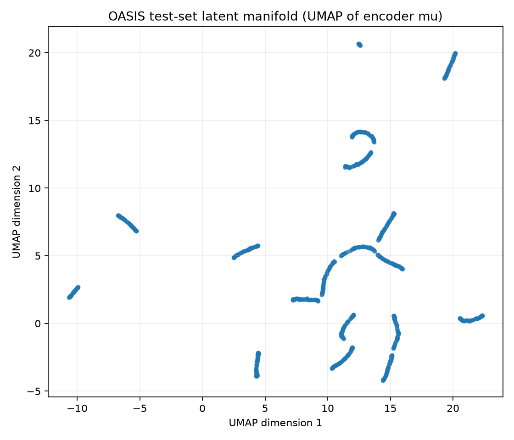

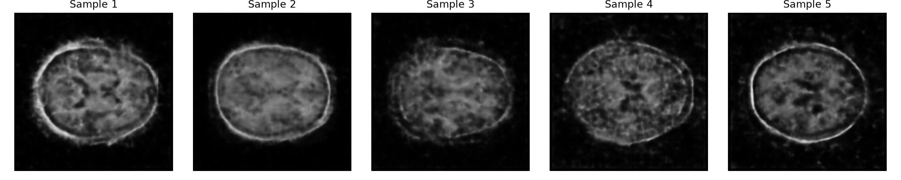

### U-Net segmentation

The best validation checkpoint occurred at epoch 24:

| Split | Class 0 DSC | Class 1 DSC | Class 2 DSC | Class 3 DSC | Mean DSC | Minimum DSC | Requirement |
|---|---:|---:|---:|---:|---:|---:|---|
| Validation (epoch 24) | 0.999443 | 0.962301 | 0.966712 | 0.979473 | 0.976982 | 0.962301 | PASS |
| Official test (544 images) | 0.999322 | 0.965655 | 0.965585 | 0.978920 | **0.977370** | **0.965585** | **PASS - every class > 0.90** |

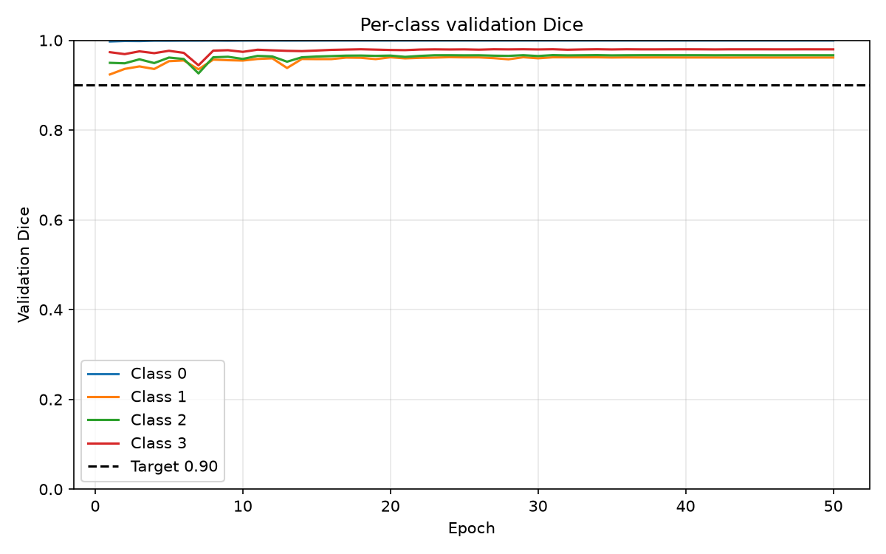

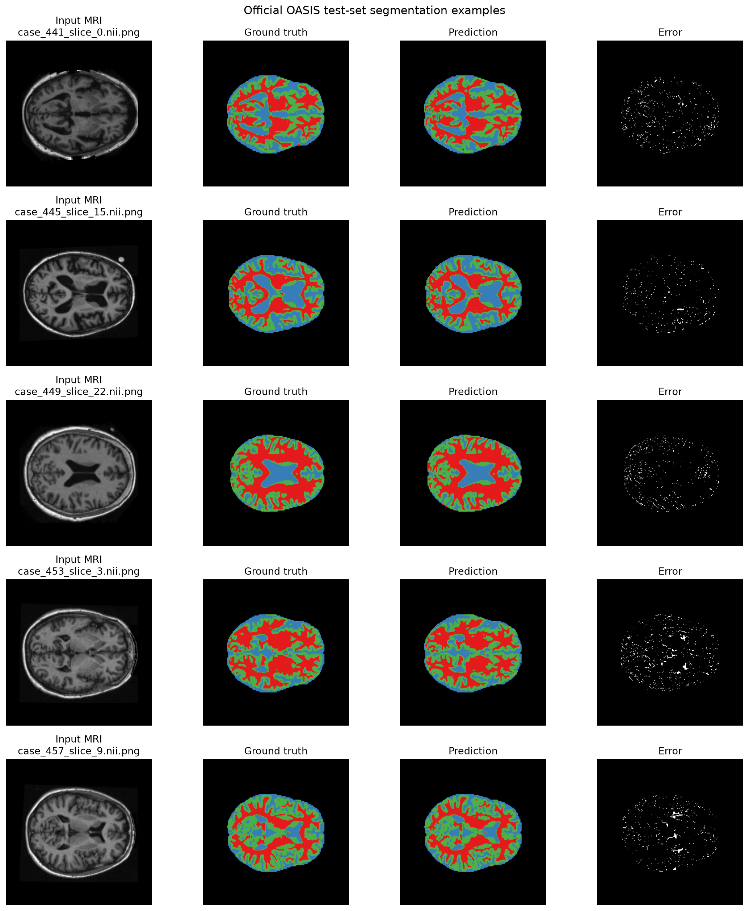

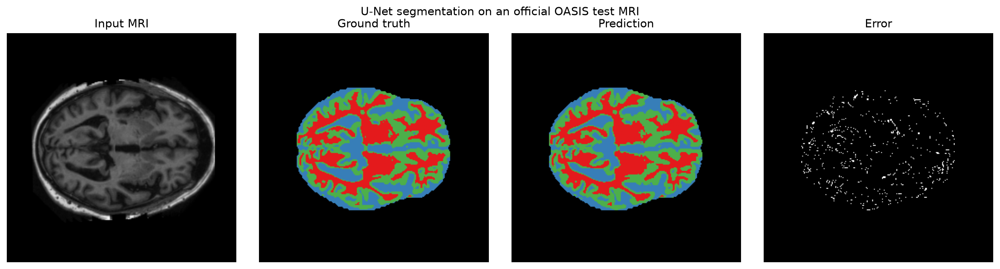

### DCGAN brain generation

The selected `dcgan_64_d_train_mode` run trained for 50 epochs. Its recorded epoch-loop time was 592.6 seconds in total (11.85 seconds per epoch on average); hardware metadata was not stored, so this timing is descriptive rather than a cross-machine benchmark.

| Epoch | D loss | G loss | Sample pixel std | Mean pairwise RMSE | Mean nearest RMSE | Near-duplicate rate |
|---:|---:|---:|---:|---:|---:|---:|
| 1 | 0.7645 | 10.4810 | 0.0547 | 0.0833 | 0.0736 | 0.0% |
| 10 | 0.8994 | 3.1322 | 0.0765 | 0.1708 | 0.0777 | 0.0% |
| 20 | 0.8537 | 2.9657 | 0.0932 | 0.1997 | 0.1132 | 0.0% |
| 40 | 0.2882 | 4.0003 | 0.0943 | 0.2001 | 0.1200 | 0.0% |
| 49 | 0.1695 | 4.4458 | **0.0982** | 0.1973 | 0.1188 | 0.0% |
| 50 | 0.5109 | 4.5823 | 0.0940 | 0.1954 | 0.1175 | **0.0%** |

The final fixed-noise grid contains visibly different brain shapes and the diagnostic threshold found no near-duplicate pairs. These simple statistics are supporting evidence only; the image grids remain the primary realism and mode-collapse check.

The discarded `dcgan_64_baseline` run ended with a 60.9% near-duplicate rate and visibly repeated brains, demonstrating why loss values alone are not sufficient for selecting a GAN checkpoint.

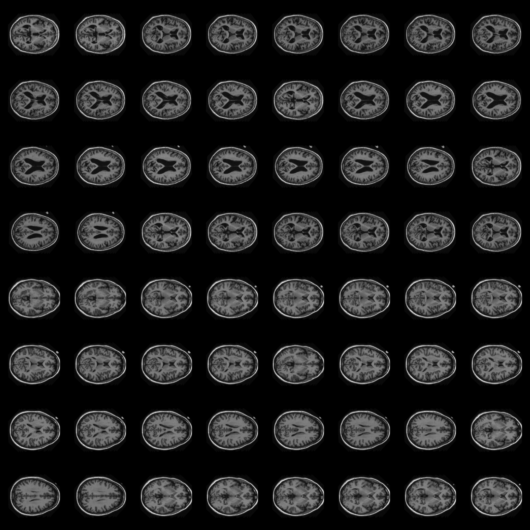

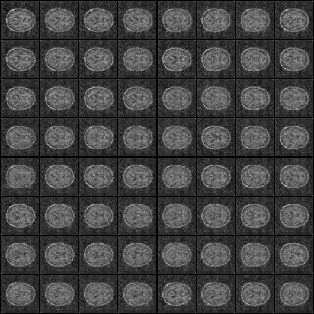

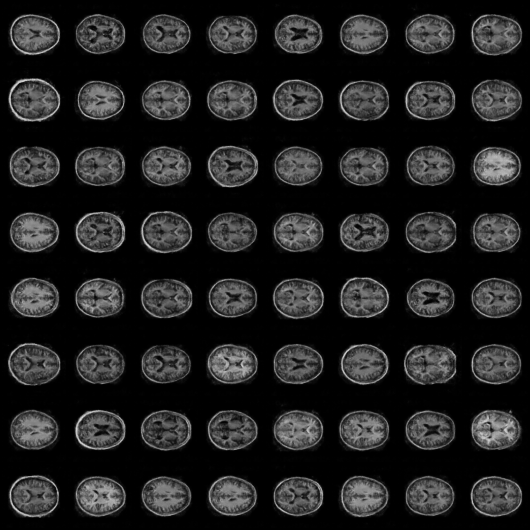

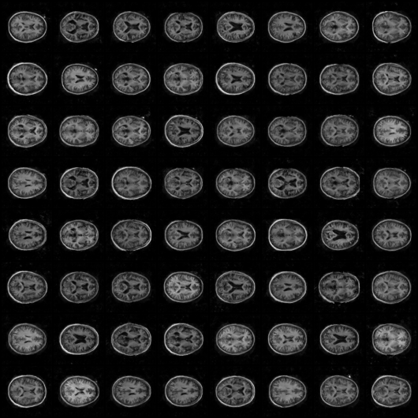

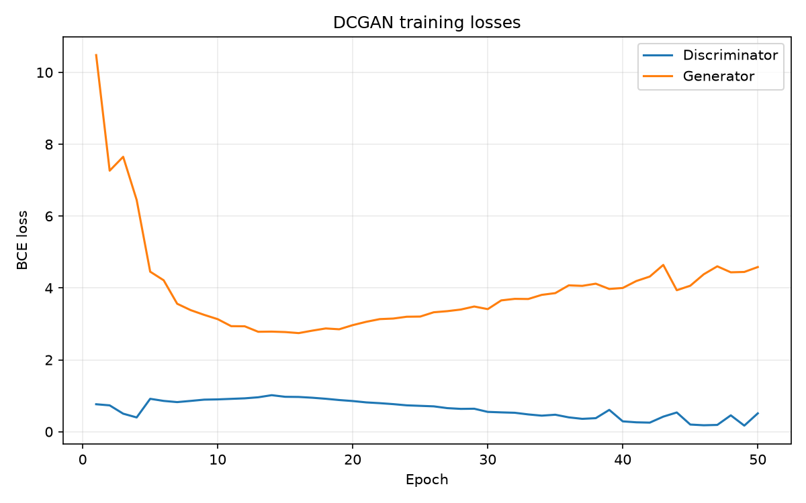

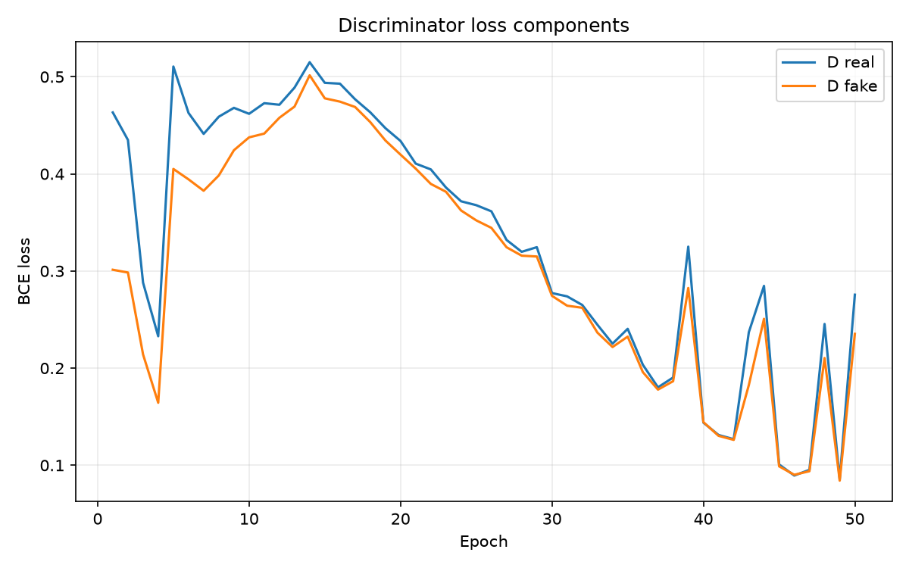
